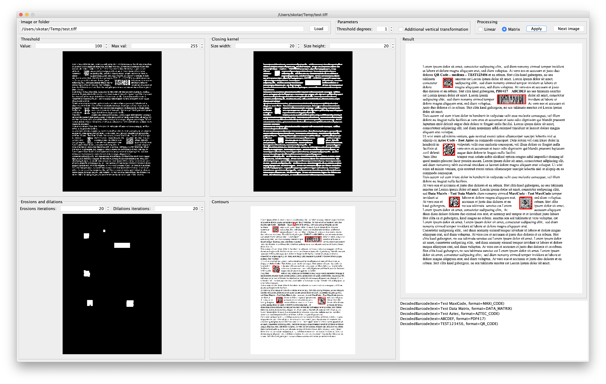

# Promena Transformer - `barcode detector - ZXing & OpenCV`
This transformer provides functionality to detect barcodes in a `application/pdf` document using ZXing 3.4.0 and OpenCV 4.1.2.

Visit [Promena#Transformer](https://github.com/BeOne-PL/promena#transformer) to understand the repository structure.

The solution was developed thanks to the following resources:
* https://www.pyimagesearch.com/2014/11/24/detecting-barcodes-images-python-opencv/
* https://stackoverflow.com/a/50519348

## Algorithm (for one page)
1. Convert to grayscale image with 300 DPI
2. Compute the Scharr gradient magnitude representation
3. Subtract the y-gradient from the x-gradient
4. Apply the binary threshold using values from `linearThresholdValue` and `linearThresholdMaxValue` parameters
5. Construct and apply the closing kernel using values from `linearKernelSizeWidth` and `linearKernelSizeHeight` parameters
6. Apply erosions and dilations using values from `linearErosionsIterations` and `linearDilationsIterations` parameters
7. Determine bounding boxes
8. Find the convex hull of each bounding box 
9. If `linearAdditionalVerticalTransformation` is true, swap `linearKernelSizeWidth` parameter with `linearKernelSizeHeight` parameter and repeat steps 2-8
10. Cut out found contours to separate images
11. Calculate tilt of each image and rotation angles to rotate the image perpendicularly
12. After rotation apply additional rotations using value from `linearRotationThresholdDegrees` parameter
13. Try to detect a barcode on the image using formats from `formats` parameter
14. Repeat steps 2-13 for the set of parameters with `matrix` prefix
15. Filter found barcodes using value from `regexFilter` parameter

## Transformation [`ZxingOpenCvBarcodeDetectorDsl`](./application-model/src/main/kotlin/pl/beone/promena/transformer/barcodedetector/zxingopencv/applicationmodel/ZxingOpenCvBarcodeDetectorDsl.kt), [`ZxingOpenCvBarcodeDetectorParametersDsl`](./application-model/src/main/kotlin/pl/beone/promena/transformer/barcodedetector/zxingopencv/applicationmodel/ZxingOpenCvBarcodeDetectorParametersDsl.kt)
The [`DataDescriptor`](https://github.com/BeOne-PL/promena/blob/master/base/promena-transformer/contract/src/main/kotlin/pl/beone/promena/transformer/contract/data/DataDescriptor.kt) has to contain at least one descriptor. If more than one descriptor is passed, the transformation will be performed on each of them separately.

## Support [`ZxingOpenCvBarcodeDetectorSupport`](./application-model/src/main/kotlin/pl/beone/promena/transformer/barcodedetector/zxingopencv/applicationmodel/ZxingOpenCvBarcodeDetectorSupport.kt)
### Media type [`ZxingOpenCvBarcodeDetectorSupport.MediaTypeSupport`](./application-model/src/main/kotlin/pl/beone/promena/transformer/barcodedetector/zxingopencv/applicationmodel/ZxingOpenCvBarcodeDetectorSupport.kt)
* `application/pdf; UTF-8` :arrow_right: `application/pdf; UTF-8`

### Parameters [`ZxingOpenCvBarcodeDetectorSupport.ParametersSupport`](./application-model/src/main/kotlin/pl/beone/promena/transformer/barcodedetector/zxingopencv/applicationmodel/ZxingOpenCvBarcodeDetectorSupport.kt)
Take a look at [Algorithm (for one page)](#algorithm-for-one-page) to understand the meaning of given parameter.
* `formats`, `List<String>`, *`["Codabar", "UPC-A", "UPC-E", "EAN-8", "EAN-13", "Code 39", "Code 128", "ITF", "RSS-14", "RSS Expanded", "QR Code", "PDF417", "Aztec Code", "Data Matrix", "MaxiCode"]`* optional
* `regexFilter`, `String`, optional
* `linearRotationThresholdDegrees`, `Int`, *`<1, 360>`*, optional
* `linearAdditionalVerticalTransformation`, `Boolean`, optional
* `linearThresholdValue`, `Double`, *`<1.0, 255.0>`*, optional
* `linearThresholdMaxVal`, `Double`, *`<1.0, 255.0>`*, optional
* `linearKernelSizeWidth`, `Double`, *`<1.0, 1000.0>`*, optional
* `linearKernelSizeHeight`, `Double`, *`<1.0, 1000.0>`*, optional
* `linearErosionsIterations`, `Int`, *`<1, 1000>`*, optional
* `linearDilationsIterations`, `Int`, *`<1, 1000>`*, optional
* `matrixRotationThresholdDegrees`, `Int`, *`<1, 360>`*, optional
* `matrixAdditionalVerticalTransformation`, `Boolean`, optional
* `matrixThresholdValue`, `Double`, *`<1.0, 255.0>`*, optional
* `matrixThresholdMaxVal`, `Double`, *`<1.0, 255.0>`*, optional
* `matrixKernelSizeWidth`, `Double`, *`<1.0, 1000.0>`*, optional
* `matrixKernelSizeHeight`, `Double`, *`<1.0, 1000.0>`*, optional
* `matrixErosionsIterations`, `Int`, *`<1, 1000>`*, optional
* `matrixDilationsIterations`, `Int`, *`<1, 1000>`*, optional

## [Metadata](https://github.com/BeOne-PL/promena-transformer-barcode-detector-metadata)
Visit to find out how to build and process barcode metadata. 

## Dependency
```xml
<dependency>
    <groupId>pl.beone.promena.transformer</groupId>
    <artifactId>barcode-detector-zxing-opencv-configuration</artifactId>
    <version>1.0.1</version>
</dependency>
```

### `promena-docker-maven-plugin`
```xml
<dependency>
    <groupId>pl.beone.promena.transformer</groupId>
    <artifactId>barcode-detector-zxing-opencv</artifactId>
    <version>1.0.1</version>
</dependency>
```

## Properties
The default values are adjusted to recognise barcodes on scanned documents.
```properties
transformer.pl.beone.promena.transformer.barcodedetector.zxingopencv.ZxingOpenCvBarcodeDetectorTransformer.priority=1
transformer.pl.beone.promena.transformer.barcodedetector.zxingopencv.ZxingOpenCvBarcodeDetectorTransformer.actors=1

# RSS-14, RSS Expanded, UPC-E produces many false-positive detections
# UPC-A, EAN-8, EAN-13 also produces false-positive detections but less than previous ones
transformer.pl.beone.promena.transformer.barcodedetector.zxingopencv.default.parameters.formats=Codabar,Code 39,Code 128,ITF,QR Code,PDF417,Aztec Code,Data Matrix,MaxiCode
transformer.pl.beone.promena.transformer.barcodedetector.zxingopencv.default.parameters.regex-filter=

transformer.pl.beone.promena.transformer.barcodedetector.zxingopencv.default.parameters.linear-rotation-threshold-degrees=1
transformer.pl.beone.promena.transformer.barcodedetector.zxingopencv.default.parameters.linear-additional-vertical-transformation=true
transformer.pl.beone.promena.transformer.barcodedetector.zxingopencv.default.parameters.linear-threshold-value=150.0
transformer.pl.beone.promena.transformer.barcodedetector.zxingopencv.default.parameters.linear-threshold-max-val=255.0
transformer.pl.beone.promena.transformer.barcodedetector.zxingopencv.default.parameters.linear-kernel-size-width=25.0
transformer.pl.beone.promena.transformer.barcodedetector.zxingopencv.default.parameters.linear-kernel-size-height=1.0
transformer.pl.beone.promena.transformer.barcodedetector.zxingopencv.default.parameters.linear-erosions-iterations=20
transformer.pl.beone.promena.transformer.barcodedetector.zxingopencv.default.parameters.linear-dilations-iterations=20

transformer.pl.beone.promena.transformer.barcodedetector.zxingopencv.default.parameters.matrix-rotation-threshold-degrees=1
transformer.pl.beone.promena.transformer.barcodedetector.zxingopencv.default.parameters.matrix-additional-vertical-transformation=false
transformer.pl.beone.promena.transformer.barcodedetector.zxingopencv.default.parameters.matrix-threshold-value=100.0
transformer.pl.beone.promena.transformer.barcodedetector.zxingopencv.default.parameters.matrix-threshold-max-val=255.0
transformer.pl.beone.promena.transformer.barcodedetector.zxingopencv.default.parameters.matrix-kernel-size-width=20.0
transformer.pl.beone.promena.transformer.barcodedetector.zxingopencv.default.parameters.matrix-kernel-size-height=20.0
transformer.pl.beone.promena.transformer.barcodedetector.zxingopencv.default.parameters.matrix-erosions-iterations=20
transformer.pl.beone.promena.transformer.barcodedetector.zxingopencv.default.parameters.matrix-dilations-iterations=20
transformer.pl.beone.promena.transformer.barcodedetector.zxingopencv.default.parameters.timeout=
```

## Evaluator
If you want to adjust parameters, run [`Main`](./evaluator/src/main/kotlin/pl/beone/promena/transformer/barcodedetector/zxingopencv/evaluator/Main.kt) from [`barcode-detector-zxing-opencv-evaluator`](./evaluator) module (you have to install OpenCV 4.1.2 on your computer).

